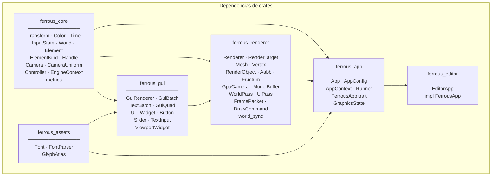
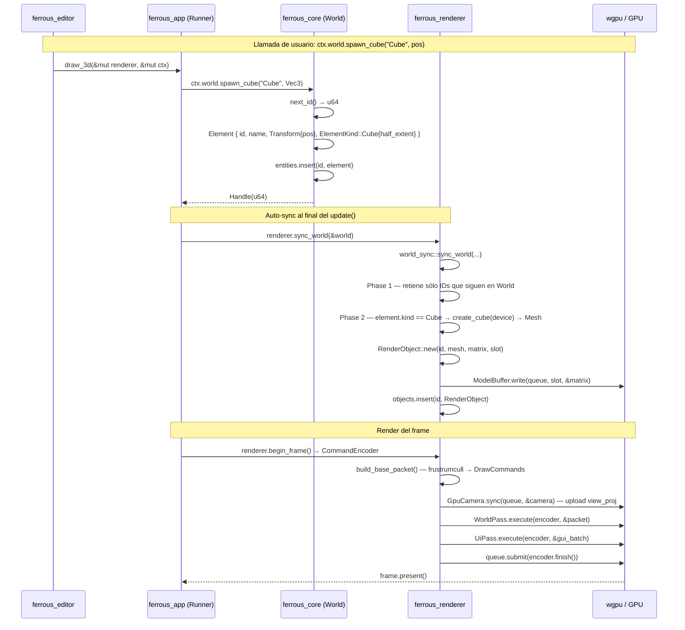
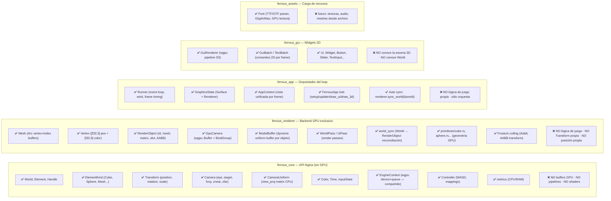
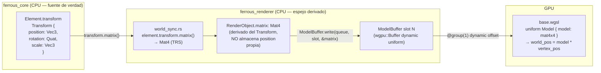
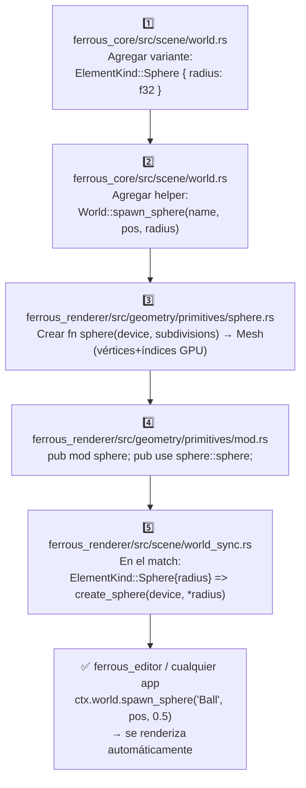
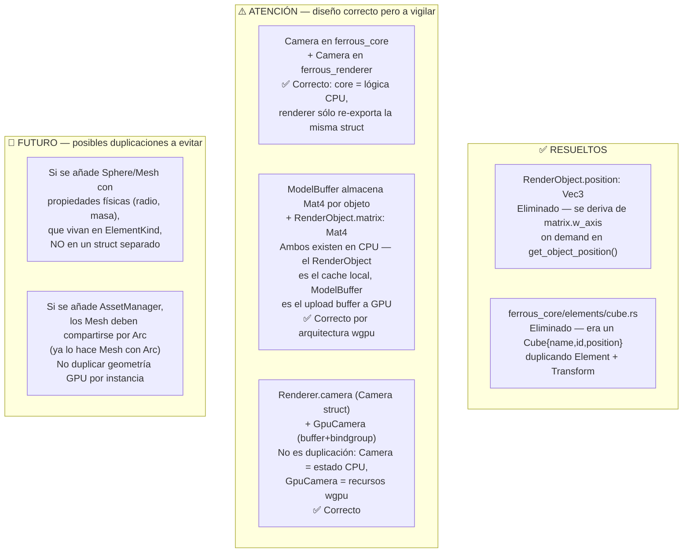

# FerrousEngine — Mapa de Flujo de Crates

> **Concepto central:** `ferrous_core` actúa como la **API pública** (tipo Spigot):
> define todos los tipos lógicos del juego sin tocar GPU.
> `ferrous_renderer` es el **backend GPU** exclusivo: habla con wgpu, genera buffers y ejecuta los render passes.
> `ferrous_app` es el **orquestador** que conecta ambos en el loop principal.

---

## Diagrama de dependencias entre crates

---

## Flujo completo de un frame — "Crear un cubo"

---

## Responsabilidades por crate (lo que DEBE y NO DEBE vivir en cada una)

---

## Flujo de datos por capa cada frame

```mermaid
flowchart TD
    INPUT["🖱️ Input (teclado, ratón)\nwinit WindowEvent"]

    subgraph "ferrous_app — Runner.render_frame()"
        CLOCK["TimeClock.tick() → Time{delta, fps}"]
        UPDATE["app.update(&mut AppContext)\n→ modifica World, cámara, viewport"]
        SYNCW["renderer.sync_world(&world)\n→ reconcilia World ↔ RenderObject"]
        CAMINPUT["renderer.handle_input(&input, dt)\n→ mueve Camera (orbit/WASD)"]
        DRAW3D["app.draw_3d(&mut renderer, &mut ctx)\n→ spawns adicionales, efectos"]
        DRAWUI["app.draw_ui(&mut GuiBatch, &mut TextBatch)\n→ widgets, texto HUD"]
        UISYS["ui.draw() → sistema de layout\n→ llena GuiBatch desde widgets"]
    end

    subgraph "ferrous_renderer — begin_frame → render_to_view"
        ENCODE["begin_frame() → CommandEncoder"]
        CAMUPLOAD["GpuCamera.sync(queue, &camera)\n→ upload view_proj a GPU"]
        CULL["build_base_packet()\n→ frustum cull + DrawCommands"]
        WORLDPASS["WorldPass.execute(encoder)\n→ set_pipeline, bind camera,\n   per-object: bind model slot,\n   draw(index_count)"]
        UIPASS["UiPass.execute(encoder)\n→ GuiRenderer render quads+texto"]
        SUBMIT["queue.submit(encoder.finish())\nframe.present()"]
    end

    subgraph "GPU"
        VS["Vertex Shader\nbase.wgsl / gui.wgsl / text.wgsl"]
        FS["Fragment Shader"]
        FB["Framebuffer → pantalla"]
    end

    INPUT --> CLOCK
    CLOCK --> UPDATE
    UPDATE --> SYNCW
    SYNCW --> CAMINPUT
    CAMINPUT --> DRAW3D
    DRAW3D --> DRAWUI
    DRAWUI --> UISYS
    UISYS --> ENCODE
    ENCODE --> CAMUPLOAD
    CAMUPLOAD --> CULL
    CULL --> WORLDPASS
    WORLDPASS --> UIPASS
    UIPASS --> SUBMIT
    SUBMIT --> VS
    VS --> FS
    FS --> FB
```

---

## Flujo de Transform — única fuente de verdad

---

## Cómo agregar un nuevo Shape (ej: Sphere)

---

## Problemas de duplicación resueltos / pendientes

