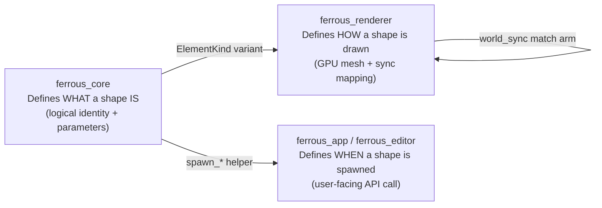
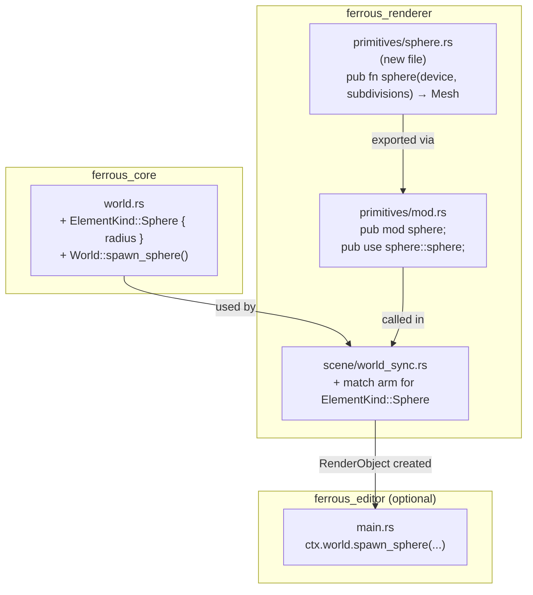
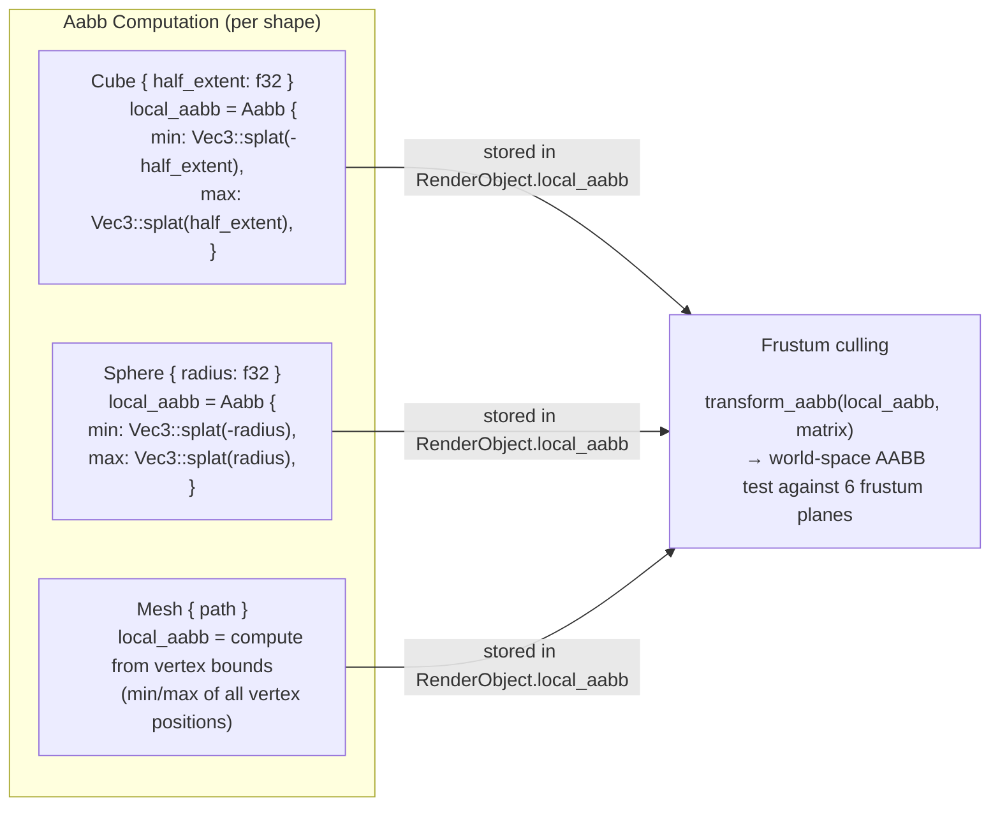
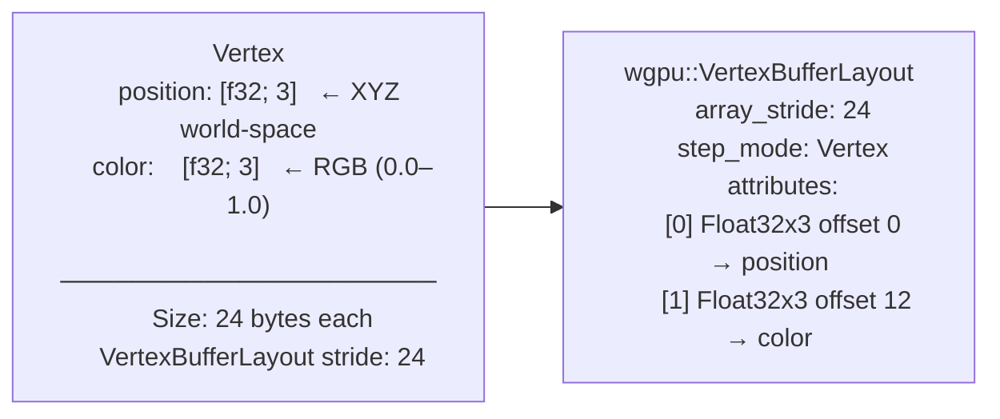
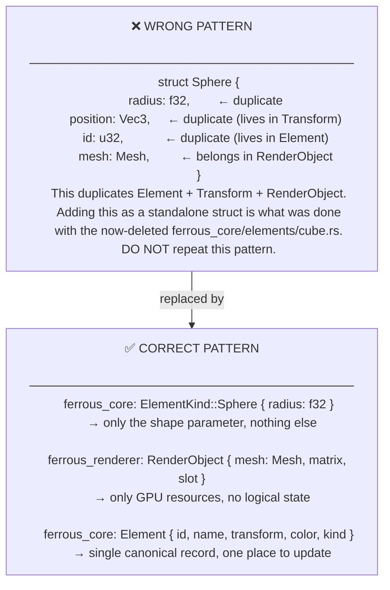
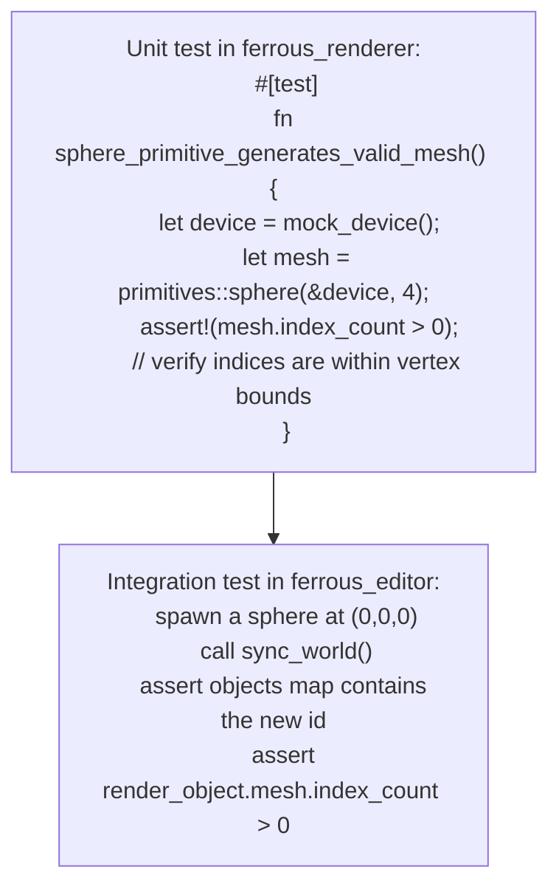

# adding-shapes

> **Description:** Step-by-step guide for adding a new primitive shape to FerrousEngine. Covers every file that must be touched, in the correct order, with no duplication of state.

---

## Overview — Where Each Concern Lives

---

## Complete 6-Step Checklist

```mermaid
flowchart TD
    S1["Step 1 — Add ElementKind variant
    ──────────────────────────────────
    File: ferrous_core/src/scene/world.rs

    pub enum ElementKind {
        Cube { half_extent: f32 },
        Sphere { radius: f32 },       ← ADD THIS
        Mesh { path: String },
        PointLight { intensity: f32 },
        Empty,
    }"]

    S2["Step 2 — Add spawn helper on World
    ──────────────────────────────────────
    File: ferrous_core/src/scene/world.rs

    impl World {
        pub fn spawn_sphere(
            &mut self,
            name: impl Into&lt;String&gt;,
            position: Vec3,
            radius: f32,
        ) → Handle {
            let id = self.next_id();
            let element = Element {
                id,
                name: name.into(),
                transform: Transform::from_position(position),
                color: Color::WHITE,
                kind: ElementKind::Sphere { radius },
                visible: true,
                tags: vec![],
            };
            self.entities.insert(id, element);
            Handle(id)
        }
    }"]

    S3["Step 3 — Create GPU primitive
    ──────────────────────────────────
    File: ferrous_renderer/src/geometry/primitives/sphere.rs

    pub fn sphere(device: &wgpu::Device, subdivisions: u32) → Mesh {
        let (vertices, indices) = build_uv_sphere(subdivisions);
        Mesh::new(device, &vertices, &indices)
    }

    fn build_uv_sphere(subdivisions: u32) → (Vec&lt;Vertex&gt;, Vec&lt;u32&gt;) {
        // latitude / longitude loops
        // vertex: position [f32;3] + color [f32;3]
        // indices: triangle strips → indexed triangles
    }"]

    S4["Step 4 — Export the primitive
    ──────────────────────────────────
    File: ferrous_renderer/src/geometry/primitives/mod.rs

    pub mod cube;
    pub mod sphere;      ← ADD THIS
    pub use cube::cube;
    pub use sphere::sphere;  ← ADD THIS"]

    S5["Step 5 — Add sync arm in world_sync
    ──────────────────────────────────────
    File: ferrous_renderer/src/scene/world_sync.rs

    In the match block inside Phase 2 (insert new):

    ElementKind::Cube { half_extent } => {
        primitives::cube(device)
    },
    ElementKind::Sphere { radius } => {    ← ADD THIS
        primitives::sphere(device, 16)     // 16 subdivisions
    },
    ElementKind::Mesh { path } => {
        load_or_cache_mesh(device, path)
    },
    ElementKind::PointLight { .. } | ElementKind::Empty => {
        continue; // no RenderObject
    }"]

    S6["Step 6 — Use in application code
    ──────────────────────────────────────
    File: ferrous_editor/src/main.rs (or any impl FerrousApp)

    fn setup(&mut self, ctx: &mut AppContext) {
        ctx.world.spawn_sphere('Ball', Vec3::ZERO, 0.5);
    }
    // → sync_world() picks it up automatically next frame
    // → sphere mesh is created once and inserted into objects map"]

    S1 --> S2 --> S3 --> S4 --> S5 --> S6
```

---

## File Touch Map

---

## AABB for New Shapes

---

## Primitive Vertex Format

---

## Shape Does Not Exist in Both Layers

---

## Testing New Shapes

