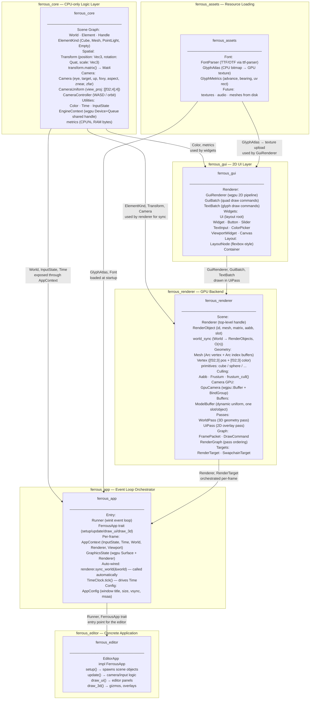
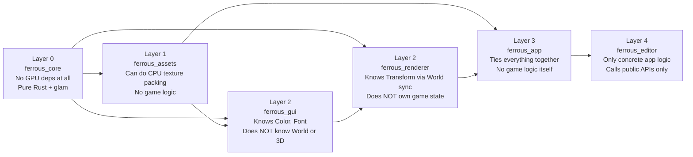

# crate-overview

> **Description:** Complete dependency graph for all FerrousEngine crates — what each crate owns, how they connect, and why the layering exists.

---

## Crate Dependency Graph

---

## Layering Rules

---

## Key Architectural Invariants

```mermaid
graph TD
    INV1["❌ ferrous_core must NEVER import wgpu\nAll GPU types live in ferrous_renderer"]
    INV2["❌ ferrous_renderer must NEVER own game state\nWorld lives exclusively in ferrous_core"]
    INV3["❌ ferrous_gui must NEVER know about 3D scene\nNo World or RenderObject imports in gui"]
    INV4["❌ ferrous_app must NEVER contain game logic\nAll behaviour lives in impl FerrousApp"]
    INV5["✅ Transform is the ONLY position source\nDerive matrix on-demand, never store separately"]
    INV6["✅ Mesh buffers are Arc-wrapped\nShared geometry = zero GPU copies per instance"]
    INV7["✅ world_sync is O(n) per frame\nInsert/remove/update separated into 3 phases"]
```

