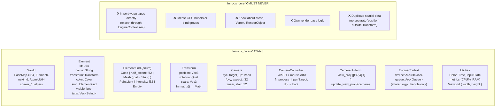
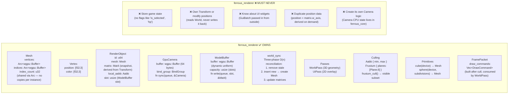
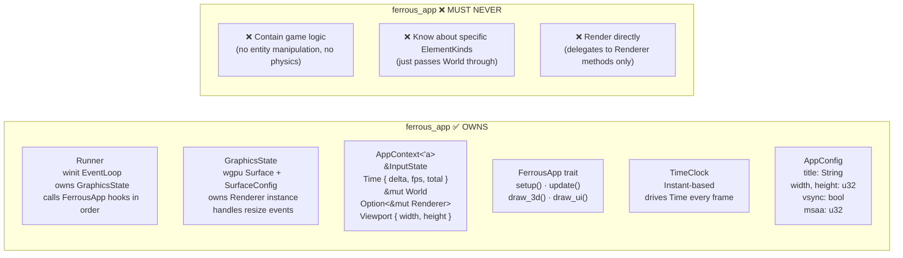
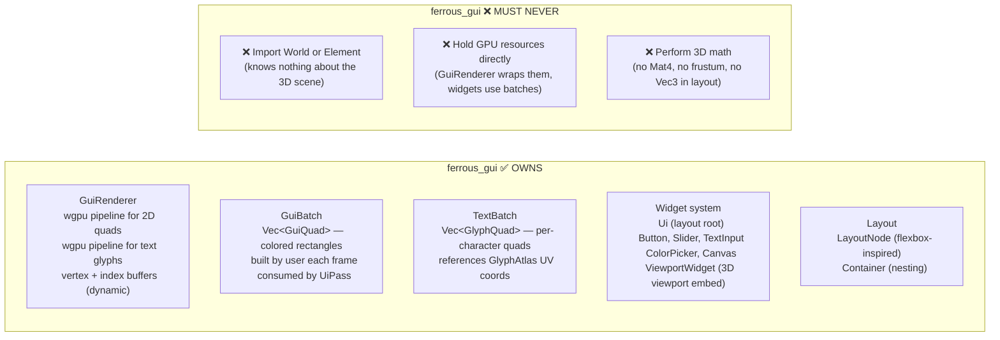
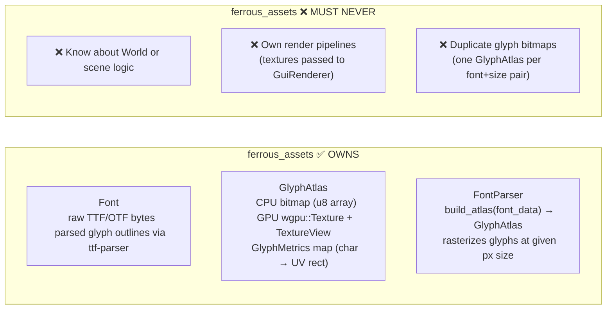
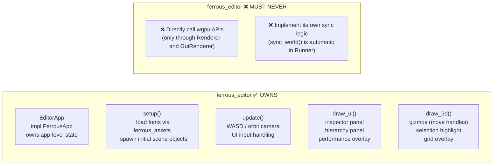
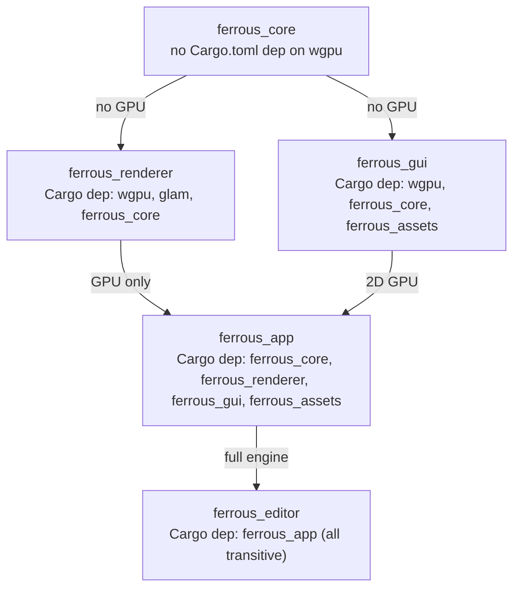

# crate-responsibilities

> **Description:** What each crate owns, what it must never do, and the precise boundary rules that keep the engine maintainable. Each crate has a single primary concern.

---

## ferrous_core — CPU Logic Layer

---

## ferrous_renderer — GPU Backend

---

## ferrous_app — Event Loop Orchestrator

---

## ferrous_gui — 2D UI Layer

---

## ferrous_assets — Resource Loading

---

## ferrous_editor — Concrete App

---

## Boundary Enforcement Summary

