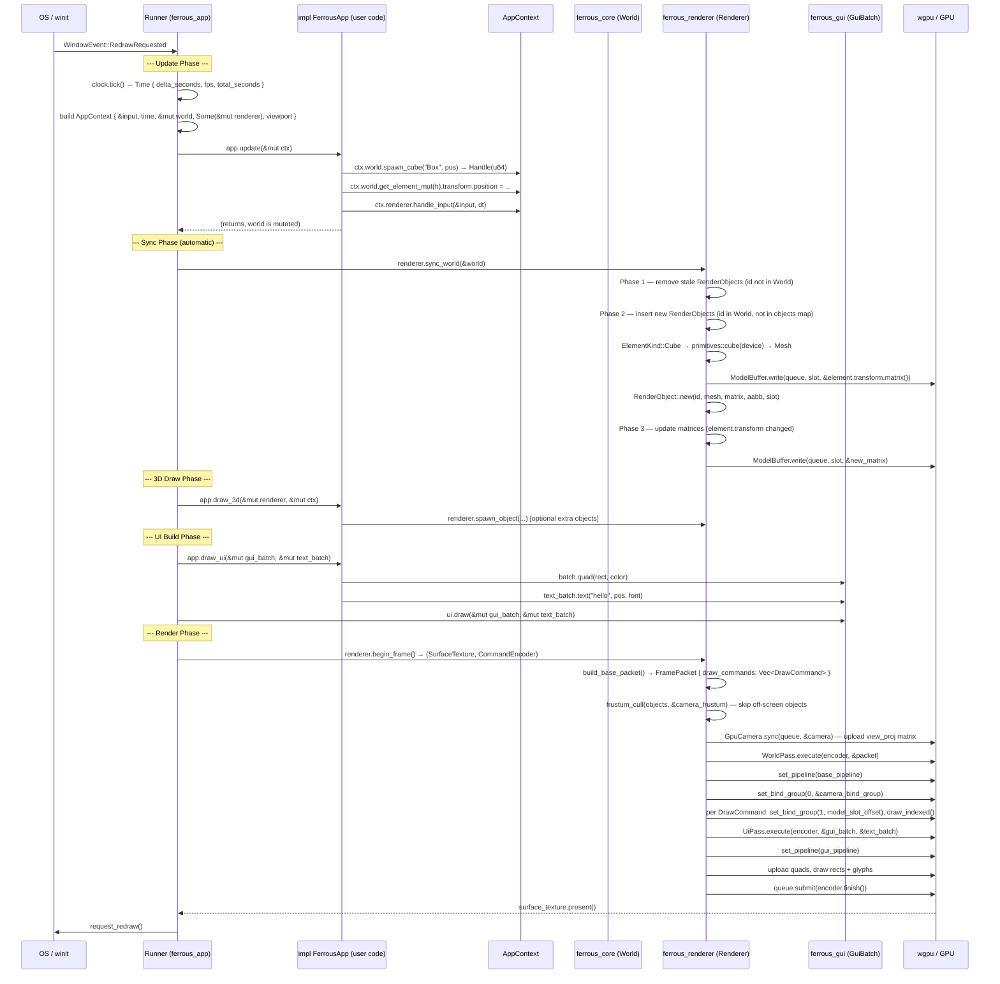
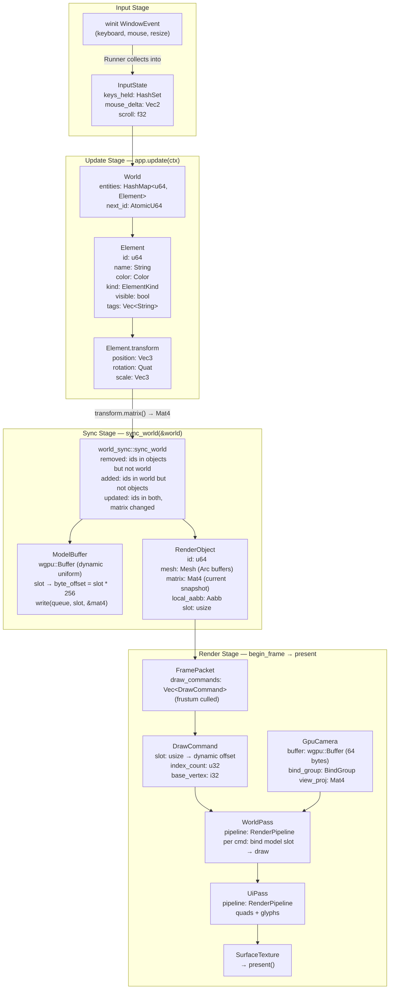
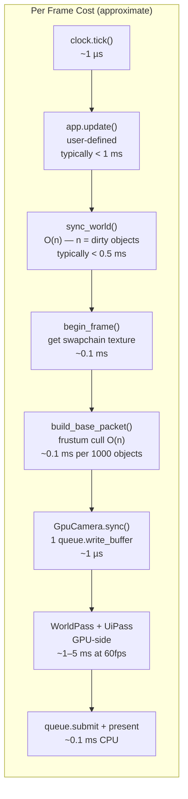
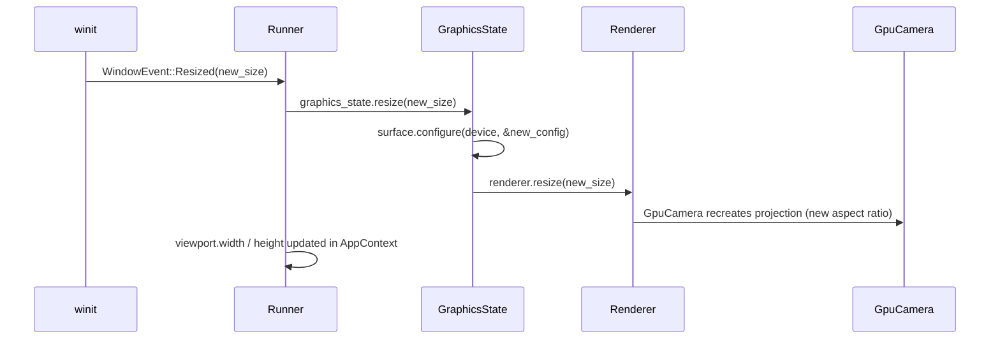
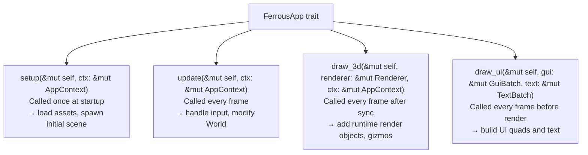

# frame-loop

> **Description:** Complete lifecycle of a single rendered frame — from winit event to GPU present. Covers the event loop, update phase, world sync, draw calls, and all data flowing through each stage.

---

## High-Level Frame Sequence

---

## Data Flow Per Stage

---

## Timing and Frame Budget

---

## Window Resize Handling

---

## FerrousApp Trait — Hook Points

