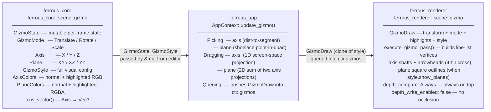
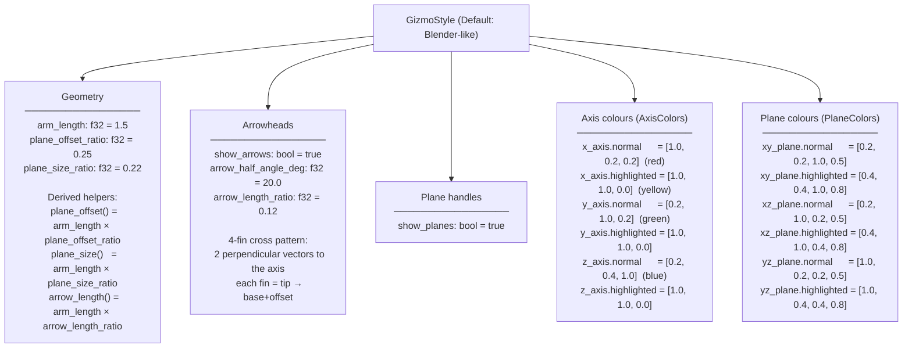
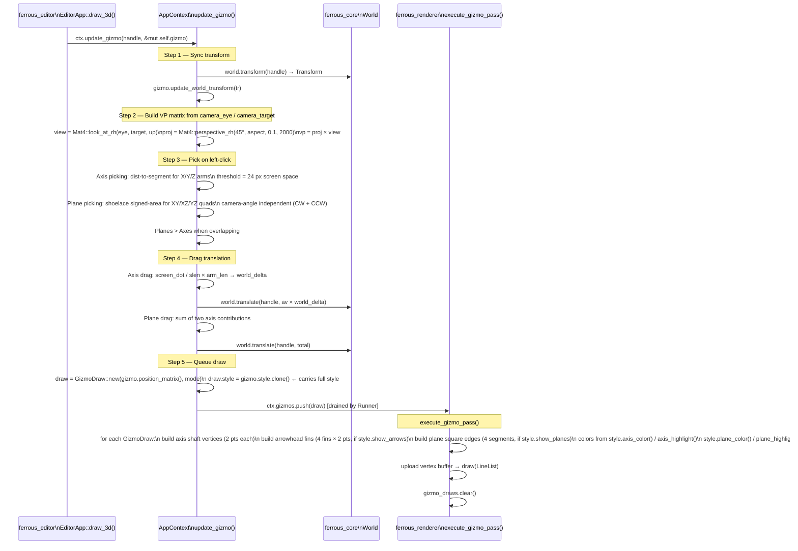
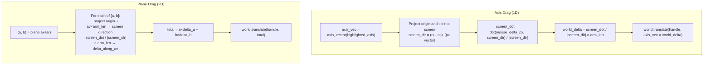
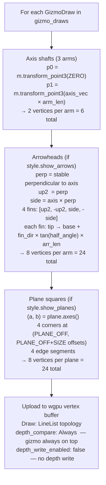
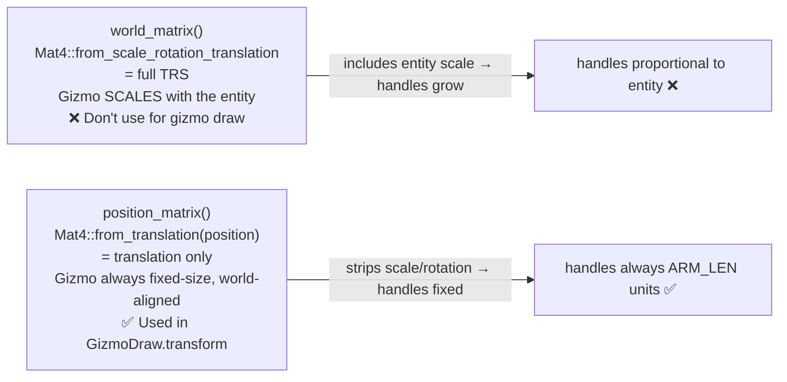

````markdown
# gizmo

> **Description:** Architecture and data flow for the editor gizmo system — translate/rotate/scale handles. Covers the three-crate split (core state, app interaction, renderer drawing), the `GizmoStyle` customisation API, picking math, and drag mechanics.

---

## Three-Crate Split



---

## GizmoStyle — Full Field Reference



---

## Customisation Examples

```mermaid
flowchart TD
    EX1["Minimal gizmo (just lines, no arrows, no planes)\n────────────────────────────────────────\ngizmo.style.show_arrows = false;\ngizmo.style.show_planes = false;"]

    EX2["Larger gizmo (bigger scene)\n────────────────────────────────────────\ngizmo.style.arm_length = 4.0;"]

    EX3["Monochrome debug gizmo\n────────────────────────────────────────\ngizmo.style.x_axis = AxisColors::new([0.8, 0.8, 0.8], [1.0, 1.0, 1.0]);\ngizmo.style.y_axis = AxisColors::new([0.8, 0.8, 0.8], [1.0, 1.0, 1.0]);\ngizmo.style.z_axis = AxisColors::new([0.8, 0.8, 0.8], [1.0, 1.0, 1.0]);"]

    EX4["Wide plane squares\n────────────────────────────────────────\ngizmo.style.plane_offset_ratio = 0.15;\ngizmo.style.plane_size_ratio   = 0.35;"]

    EX5["Narrow arrowhead\n────────────────────────────────────────\ngizmo.style.arrow_half_angle_deg = 10.0;\ngizmo.style.arrow_length_ratio   = 0.08;"]
```



---

## Per-Frame Data Flow



---

## Picking Algorithms

```mermaid
flowchart TD
    subgraph "Axis Picking — Distance to Segment"
        AP1["Project origin O and tip T into screen pixels"]
        AP2["Mouse M in screen pixels"]
        AP3["t = clamp( dot(M-O, T-O) / |T-O|² , 0, 1 )"]
        AP4["closest = O + t×(T-O)"]
        AP5["dist = |M - closest|"]
        AP6["if dist < 24 px → axis candidate"]
        AP1 --> AP2 --> AP3 --> AP4 --> AP5 --> AP6
    end

    subgraph "Plane Picking — Shoelace Point-in-Quad"
        PP1["Project 4 world corners into screen pixels\nSkip if any corner behind camera (w ≤ 0)"]
        PP2["Compute signed area via shoelace:\nquad_area = Σ(xᵢ×yⱼ - xⱼ×yᵢ)\nsign = quad_area.signum()"]
        PP3["For each edge i→j:\ncross = (xⱼ-xᵢ)×(my-yᵢ) - (yⱼ-yᵢ)×(mx-xᵢ)\nif cross×sign < 0 → outside"]
        PP4["All 4 edges pass → inside"]
        PP1 --> PP2 --> PP3 --> PP4
    end

    subgraph "Priority"
        PR["Plane match → use plane (clear axis)\nAxis match only → use axis (clear plane)\nNeither → clear both, dragging = false"]
    end
```



---

## Drag Translation Math



---

## Renderer Vertex Generation



---

## position_matrix() vs world_matrix()



---

## File Reference

| File | Role |
|---|---|
| `ferrous_core/src/scene/gizmo.rs` | `GizmoState`, `GizmoStyle`, `AxisColors`, `PlaneColors`, `GizmoMode`, `Axis`, `Plane`, `axis_vector()` |
| `ferrous_core/src/scene/mod.rs` | Re-exports `GizmoStyle`, `AxisColors`, `PlaneColors`, `Axis`, `Plane`, `GizmoMode`, `GizmoState`, `axis_vector` |
| `ferrous_renderer/src/scene/gizmo.rs` | `GizmoDraw` — transform + mode + highlights + style |
| `ferrous_renderer/src/pipeline/gizmo.rs` | wgpu `LineList` pipeline, `depth_compare: Always`, `depth_write_enabled: false` |
| `ferrous_renderer/src/lib.rs` (`execute_gizmo_pass`) | Vertex generation — shafts, arrowheads, plane squares |
| `ferrous_app/src/context.rs` (`update_gizmo`) | Picking + drag + queue — the entire interaction API |
| `ferrous_editor/src/app.rs` (`draw_3d`) | One-liner call: `ctx.update_gizmo(sel, &mut self.gizmo)` |
````
