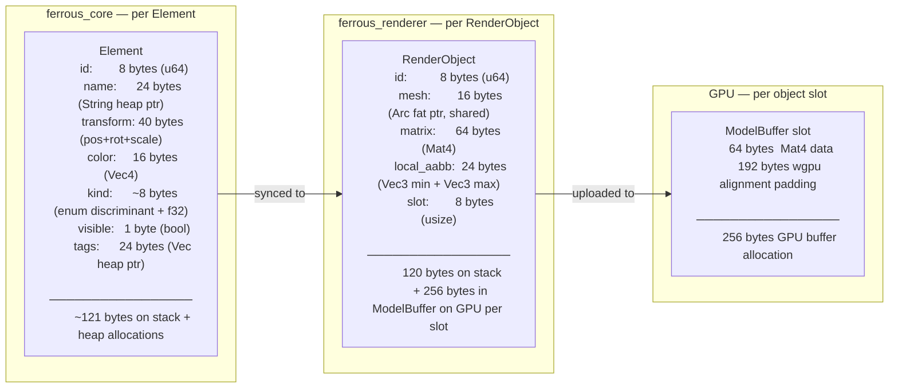
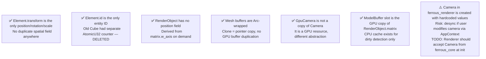

# memory-audit

> **Description:** Full audit of data duplication issues in the codebase — what was fixed, why it was wrong, how it was resolved, and what to watch for in the future.

---

## Fixed Issues

```mermaid
graph TD
    subgraph "FIX 1 — RenderObject.position removed"
        F1A["❌ Before
        ─────────────────────────────────────────
        struct RenderObject {
            id:          u64,
            mesh:        Mesh,
            matrix:      Mat4,   ← contains tx, ty, tz in w_axis
            position:    Vec3,   ← 12 bytes, DUPLICATE of matrix.w_axis.xyz
            local_aabb:  Aabb,
            slot:        usize,
        }
        Bug surface: set_matrix() had to manually sync
        position = matrix.w_axis.xyz — easy to forget."]

        F1B["✅ After
        ─────────────────────────────────────────
        struct RenderObject {
            id:          u64,
            mesh:        Mesh,
            matrix:      Mat4,
            local_aabb:  Aabb,
            slot:        usize,
        }
        fn get_object_position(id) → Vec3 {
            let w = obj.matrix.w_axis;
            Vec3::new(w.x, w.y, w.z)  ← derived on demand
        }"]

        F1A -->|"12 bytes × N objects freed\ndesync risk eliminated"| F1B
    end

    subgraph "FIX 2 — ferrous_core/elements/cube.rs deleted"
        F2A["❌ Before
        ─────────────────────────────────────────
        // ferrous_core/src/elements/cube.rs
        struct Cube {
            size:     Vec3,   ← duplicate of Transform.scale
            name:     String, ← duplicate of Element.name
            id:       u32,    ← DIFFERENT counter than Element.id (AtomicU64 vs AtomicU32)
            position: Vec3,   ← duplicate of Transform.position
        }
        Problem: separate ID counter → IDs collided with World entity IDs
        Not used in any production code path — dead weight"]

        F2B["✅ After
        ─────────────────────────────────────────
        // ferrous_core/src/elements/ — DIRECTORY DELETED
        // pub mod elements; — REMOVED from lib.rs
        Shape parameters live in:
            ElementKind::Cube { half_extent: f32 }
        Nothing else is needed."]

        F2A -->|"struct removed\ndirectory deleted\nno broken callers"| F2B
    end
```

---

## Correct Dual-Representation (Not Duplication)

```mermaid
graph TD
    subgraph "Camera — Two representations, two responsibilities"
        CAM1["ferrous_core: Camera
        ──────────────────────────────────
        eye:    Vec3
        target: Vec3
        up:     Vec3
        fovy:   f32
        aspect: f32
        znear / zfar: f32
        PURPOSE: CPU camera state, user-readable,
        modified by CameraController each frame"]

        CAM2["ferrous_renderer: GpuCamera
        ──────────────────────────────────
        buffer:     wgpu::Buffer  (64 bytes on GPU)
        bind_group: BindGroup
        fn sync(queue, &Camera) → uploads view_proj
        PURPOSE: GPU resource handle, not game state
        NOT duplication — different abstraction layer"]

        CAM1 -->|"GpuCamera.sync(queue, &camera)\nuploads view_proj once per frame"| CAM2
    end

    subgraph "ModelBuffer + RenderObject.matrix — Two representations, two layers"
        MB["ModelBuffer slot N
        ──────────────────────────────────
        wgpu::Buffer segment (64 bytes + 192 padding)
        PURPOSE: GPU-side storage for model matrix
        Written to via queue.write_buffer()"]

        RO["RenderObject.matrix: Mat4
        ──────────────────────────────────
        CPU-side current snapshot of the matrix
        PURPOSE: frustum culling uses this for AABB transform,
        also used to detect if an update is needed (dirty check)
        NOT duplication — CPU cache for GPU-upload decision"]

        RO -->|"ModelBuffer.write(queue, slot, &matrix)\nonly when matrix changes"| MB
    end
```

---

## Future Risks to Watch

```mermaid
graph TD
    subgraph "Risk 1 — Physical properties on shapes"
        R1["If you add physics (radius, mass, collider),
        ─────────────────────────────────────────
        ✅ DO:   Add to ElementKind variant params
                 ElementKind::Sphere { radius: f32, mass: f32 }
        ❌ DON'T: Create a separate PhysicsSphere struct
                  with its own position/id/name"]
    end

    subgraph "Risk 2 — Shared GPU meshes"
        R2["If 1000 identical spheres are spawned,
        ─────────────────────────────────────────
        ✅ DO:   Cache Mesh by shape key:
                 mesh_cache: HashMap&lt;ShapeKey, Mesh&gt;
                 Mesh clones are cheap (Arc::clone = pointer copy)
        ❌ DON'T: Call primitives::sphere(device) 1000×
                  → 1000 vertex+index buffer allocations on GPU"]
    end

    subgraph "Risk 3 — Asset loading duplication"
        R3["When AssetManager is added,
        ─────────────────────────────────────────
        ✅ DO:   Return Handle&lt;Mesh&gt; or Arc&lt;Mesh&gt;
                 → all users share one wgpu::Buffer per mesh
        ❌ DON'T: Let each RenderObject own a unique Mesh
                  with independently allocated GPU buffers"]
    end

    subgraph "Risk 4 — GUI state echoing scene state"
        R4["If an inspector panel shows element position,
        ─────────────────────────────────────────
        ✅ DO:   Read directly from element.transform.position
                 in draw_ui() each frame (zero copy)
        ❌ DON'T: Mirror position into a separate GuiState struct
                  → requires manual sync every frame"]
    end
```

---

## Memory Cost Per Object (Current State)

---

## Duplication Audit Checklist

