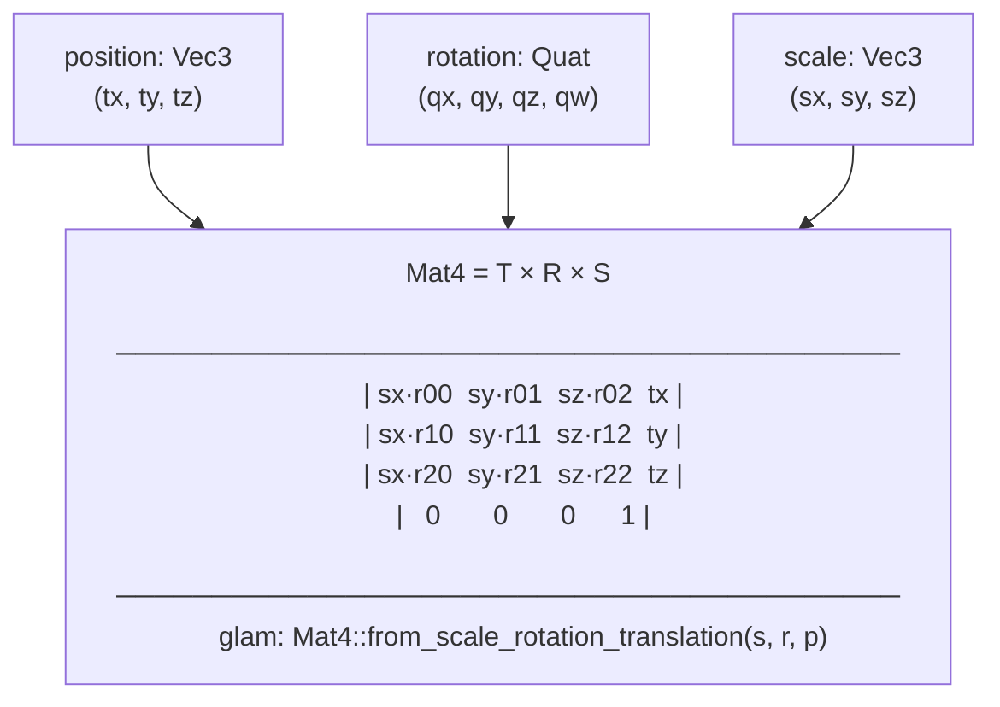
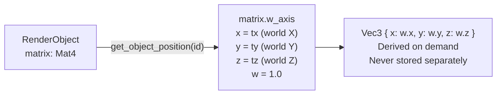
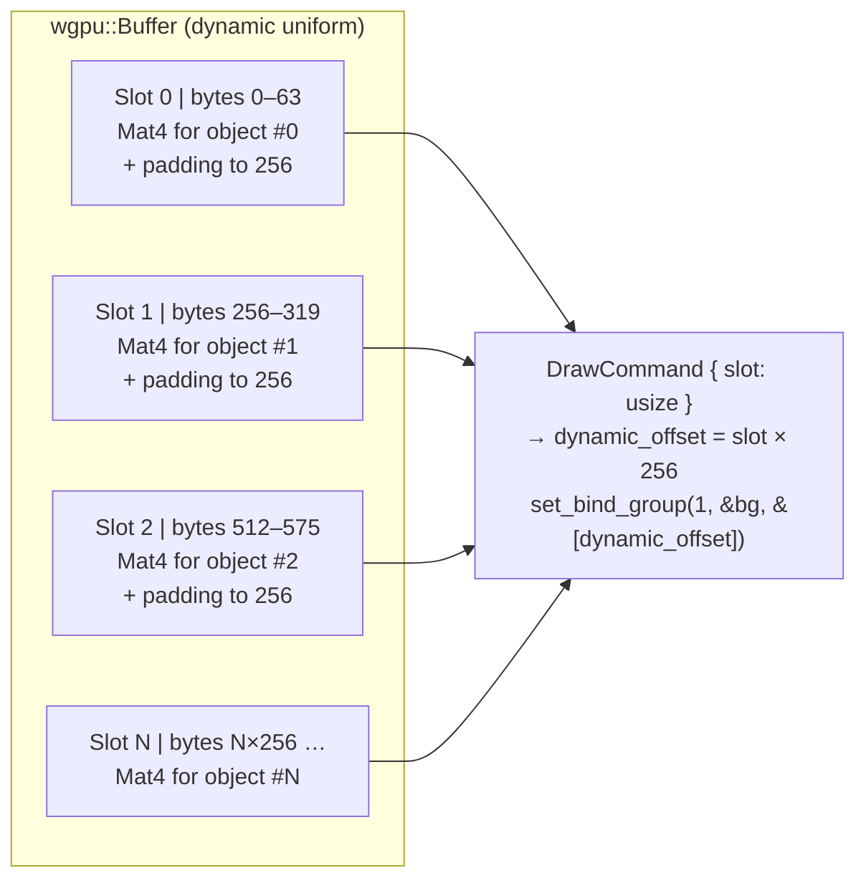
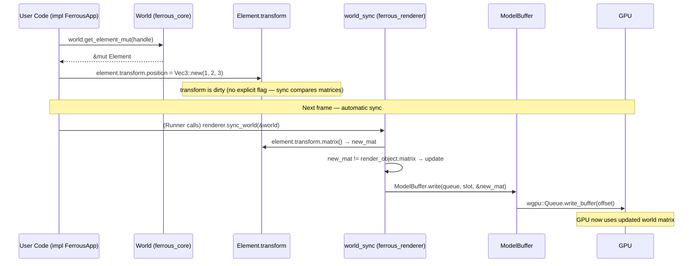
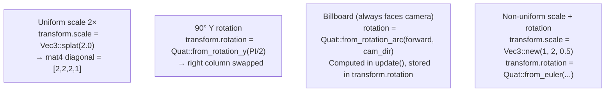

# transform-pipeline

> **Description:** How spatial data travels from user code to the GPU — the complete Transform → Mat4 → ModelBuffer → shader pipeline. This file also documents why there is exactly one position, one rotation, and one scale per scene object.

---

## Single Source of Truth

```mermaid
flowchart LR
    subgraph "ferrous_core — CPU Source of Truth"
        TF["Element.transform : Transform
        ─────────────────────────
        position : Vec3   (3× f32, 12 bytes)
        rotation : Quat   (4× f32, 16 bytes)
        scale    : Vec3   (3× f32, 12 bytes)
        ─────────────────────────
        Total: 40 bytes per element"]
    end

    subgraph "ferrous_renderer — Derived CPU Snapshot"
        SYNC["world_sync.rs
        element.transform.matrix()
        → Mat4 (TRS decomposed)"]
        RO["RenderObject.matrix : Mat4
        ─────────────────────────
        16× f32 = 64 bytes per object
        Derived snapshot only —
        NOT authoritative"]
        MB["ModelBuffer slot N
        ─────────────────────────
        wgpu::Buffer (dynamic uniform)
        byte_offset = slot × 256
        write(queue, slot, &mat4)"]
    end

    subgraph "GPU — Shader Input"
        SH["base.wgsl
        @group(1) @binding(0)
        var&lt;uniform&gt; model: ModelUniform;
        struct ModelUniform { mat: mat4x4&lt;f32&gt; }
        ──────────────────────
        let world_pos = model.mat * vec4(pos, 1.0);"]
    end

    TF -->|"fn matrix() builds\nMat4::from_scale_rotation_translation\nno allocation"| SYNC
    SYNC --> RO
    RO -->|"ModelBuffer.write(queue, slot, &mat)"| MB
    MB -->|"@group(1) dynamic offset\nbind per draw call"| SH
```

---

## matrix() Decomposition

---

## Position Derivation (No Redundant Storage)

> **Rule:** `RenderObject` does **not** have a `position: Vec3` field.  
> Position is extracted from `matrix.w_axis.xyz` when needed.  
> This eliminates 12 bytes/object of redundant storage and a potential desync bug where `position != matrix.translation`.

---

## Three-Phase Sync in Detail

```mermaid
flowchart TD
    subgraph "Phase 1 — Remove Stale"
        P1A["Iterate objects map keys"]
        P1B["If id NOT in world.entities → remove RenderObject\nfree ModelBuffer slot"]
        P1A --> P1B
    end

    subgraph "Phase 2 — Insert New"
        P2A["Iterate world.entities"]
        P2B["If id NOT in objects map:"]
        P2C["match element.kind:
        Cube { half_extent } → primitives::cube(device)
        Mesh { path } → load/cache mesh
        PointLight → no RenderObject (light-only)
        Empty → no RenderObject"]
        P2D["alloc_slot() → usize"]
        P2E["RenderObject::new(id, mesh, matrix, aabb, slot)"]
        P2F["ModelBuffer.write(queue, slot, &matrix)"]
        P2G["objects.insert(id, render_object)"]
        P2A --> P2B --> P2C --> P2D --> P2E --> P2F --> P2G
    end

    subgraph "Phase 3 — Update Matrices"
        P3A["Iterate objects map"]
        P3B["Fetch element from world by id"]
        P3C["new_matrix = element.transform.matrix()"]
        P3D["If new_matrix != render_object.matrix:"]
        P3E["render_object.matrix = new_matrix"]
        P3F["ModelBuffer.write(queue, slot, &new_matrix)"]
        P3A --> P3B --> P3C --> P3D --> P3E --> P3F
    end

    Phase1 --> Phase2 --> Phase3
```

---

## ModelBuffer Memory Layout

> **Why 256-byte alignment?** `wgpu` requires dynamic uniform offsets to be aligned to `min_uniform_buffer_offset_alignment`, which is 256 bytes on most devices.

---

## Transform Modification Flow (User Perspective)

---

## Scale and Rotation Examples

